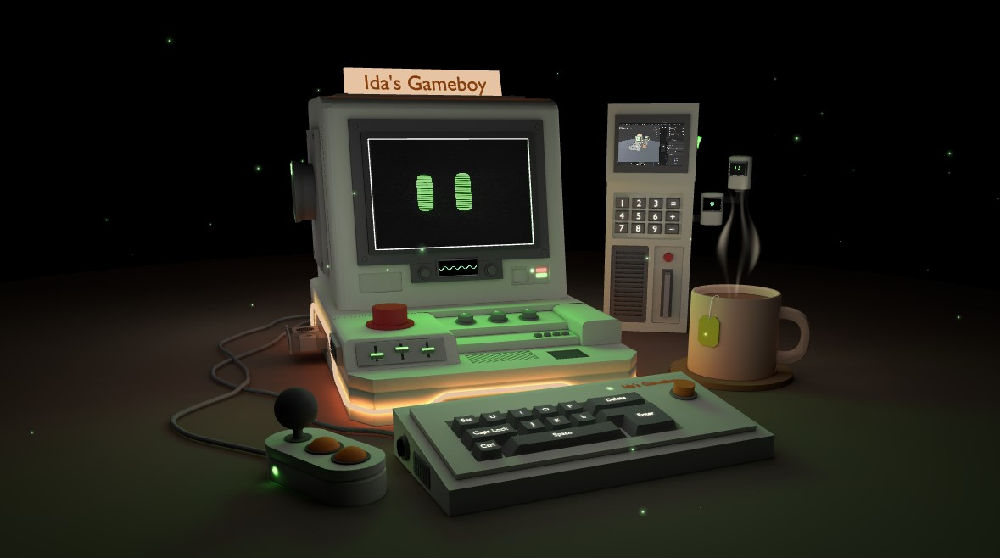

# 3D Portfolio

An interactive 3D portfolio modeled as a Gameboy! This project showcases my projects, profile, skills, and design interests in a unique and engaging way. The 3D model was created in Blender, and the interactive experience is powered by Three.js.



## Setup

Follow these steps to set up the project locally:

### Prerequisites

- Download and install [Node.js](https://nodejs.org/en/download/).
- Ensure you have a compatible code editor (e.g., [VS Code](https://code.visualstudio.com/)).

### Installation

1. Clone the repository:
   ```bash
   git clone <repository-url>
   cd 3d-portfolio
   ```

2. Install dependencies (only required the first time):
   ```bash
   npm install
   ```

3. Start the development server:
   ```bash
   npm run dev
   ```

4. Open your browser and navigate to:
   ```
   http://localhost:5173
   ```

## Tools & Technologies

- **Blender**: For 3D modeling of the Gameboy.
- **Three.js**: To render and animate the 3D model.
- **JavaScript**: For interactivity and logic.
- **Node.js**: To manage dependencies and run the development server.

